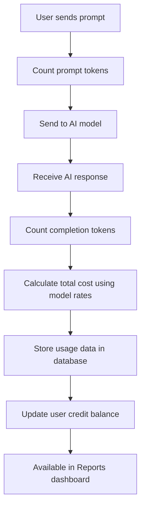

Understand how Weam calculates and tracks credits for your AI model usage across different providers like OpenAI, Anthropic, Gemini, and Hugging Face.

## Overview

Weam's credit system tracks and calculates:
- **Prompt tokens**: Input text sent to the AI model
- **Completion tokens**: AI-generated response text  
- **Total cost**: Credits consumed per request
- **Usage analytics**: Stored per thread/session for reporting and billing

## How Credit Calculation Works

### Token-Based Pricing Model

Credits are calculated based on token usage:
- **Input tokens** (your prompts): Lower cost per token
- **Output tokens** (AI responses): Higher cost per token
- **Model complexity**: Advanced models cost more credits per token

### Real-Time Tracking
- Tokens counted for every AI interaction
- Credits calculated immediately after each response
- Usage stored by user, Brain, and conversation thread
- Available in Reports for monitoring and optimization

## Technical Implementation

### Core Components

#### Cost Calculator
Handles token counting and cost calculation for each LLM request.

**Key Functions:**

| Function | Purpose |
|--------|---------|
| `addPromptTokens(count)` | Tracks input tokens from user prompts |
| `addCompletionTokens(count)` | Tracks output tokens from AI responses |
| `calculateTotalCost(modelName)` | Calculates total credits using model rates |

#### Callback Handler
Automatically processes and stores cost data after each AI interaction.

**Process Flow:**
1. Collects prompt + completion tokens from the AI response
2. Calls cost calculation function
3. Creates comprehensive token usage data
4. Stores data in MongoDB

#### Model Cost Mapping

Each AI provider has specific credit rates defined per 1,000 tokens.

**OpenAI Example:**
```javascript
const MODEL_COST_PER_1K_TOKENS = {
    "gpt-4": 0.06,
    "gpt-4-32k": 0.12, 
    "gpt-3.5-turbo": 0.0015,
    "gpt-4o": 0.005,
    "gpt-4o-mini": 0.00015
};
```

**Gemini Example:**
```javascript
const MODEL_COST_PER_1K_INPUT_TOKENS = {
    "gemini-1.5-flash": 0.000075,
    "gemini-1.5-flash-8b": 0.0000375,
    "gemini-1.5-pro": 0.00125
};

const MODEL_COST_PER_1K_OUTPUT_TOKENS = {
    "gemini-1.5-flash": 0.0003,
    "gemini-1.5-flash-8b": 0.00015,
    "gemini-1.5-pro": 0.005
};
```

### Data Persistence

#### Thread Repository
Stores detailed usage data for each conversation thread:

**Stored Data:**
- Thread/session identification
- Prompt & completion token counts
- Total credit cost per interaction
- Model metadata and timestamps
- User and Brain association

**Usage:**
```javascript
await threadRepo.storeUsage({
    threadId: threadId,
    tokenUsage: {
        promptTokens: promptTokens,
        completionTokens: completionTokens,
        totalCost: totalCost
    },
    modelName: modelName
});
```

## Credit Calculation Workflow



### Step-by-Step Process

1. **User Interaction**: User sends a prompt in any Brain
2. **Token Counting**: System counts input tokens
3. **AI Processing**: Request sent to selected AI model
4. **Response Analysis**: Completion tokens counted
5. **Cost Calculation**: Total credit usage computed
6. **Data Storage**: Callback stores all usage data
7. **Persistence**: MongoDB stores the data
8. **Reporting**: Data becomes available in usage analytics

## Multi-Provider Support

### Provider-Specific Handlers

Each AI provider has dedicated cost calculation logic:

**OpenAI Handler:**
- Supports GPT-3.5, GPT-4, GPT-4o models
- Unified pricing for input/output tokens

**Gemini Handler:**
- Supports Gemini 1.5 Flash, Pro models
- Separate pricing for input vs output tokens

**Anthropic Handler:**
- Supports Claude models
- Context-aware pricing for long conversations

**Hugging Face Handler:**
- Supports open-source models
- Custom pricing configuration

### Implementation Example

```javascript
// Initialize cost tracking
const costCalculator = new CostCalculator();

// Track token usage
costCalculator.addPromptTokens(promptTokens);
costCalculator.addCompletionTokens(completionTokens);

// Calculate credits
const totalCredits = costCalculator.calculateTotalCost(modelName);

// Store usage data
await storeUsageData({
    threadId: threadId,
    promptTokens: promptTokens,
    completionTokens: completionTokens,
    totalCost: totalCredits,
    modelName: modelName
});
```

## Monitoring Your Usage

### Reports Dashboard
Access detailed usage analytics through **Settings** → **Reports**:

**Available Metrics:**
- **Total credits** consumed by user and time period
- **Model usage** breakdown showing which AI models are used most
- **Token efficiency** comparing input vs output token ratios
- **Cost trends** over time for budget planning
- **Team usage** patterns for optimization opportunities

## Implementation Architecture

### Cost Calculation Module

**Location:** Node.js backend cost calculation services

**Core Functions:**

| Function | Purpose |
|----------|---------|
| `calculateTokenCost()` | Core token counting and cost calculation |
| `storeUsageData()` | Database persistence for usage tracking |
| `getModelPricing()` | Retrieve pricing for specific models |
| `trackUsageMetrics()` | Real-time usage monitoring |

## Extending to New Providers

To add support for new AI providers:

1. **Define Cost Mapping**: Set credit rates per 1K tokens for each model
2. **Implement Tracking**: Add token counting logic
3. **Store Data**: Ensure usage data is persisted to MongoDB
4. **Test Integration**: Verify accurate token counting and cost calculation

### Example Template

```javascript
// New provider cost handler
class NewProviderCostHandler {
    constructor() {
        this.MODEL_COST_PER_1K_TOKENS = {
            "new-model-1": 0.002,
            "new-model-2": 0.008,
        };
    }
    
    async calculateCost(promptTokens, completionTokens, modelName) {
        const rate = this.MODEL_COST_PER_1K_TOKENS[modelName];
        const totalTokens = promptTokens + completionTokens;
        const cost = (totalTokens / 1000) * rate;
        
        // Store usage data
        await this.storeUsageData({
            promptTokens,
            completionTokens,
            totalCost: cost,
            modelName
        });
        
        return cost;
    }
}
```

---

Understanding credits helps you optimize costs while maximizing the value of AI in your workflows.