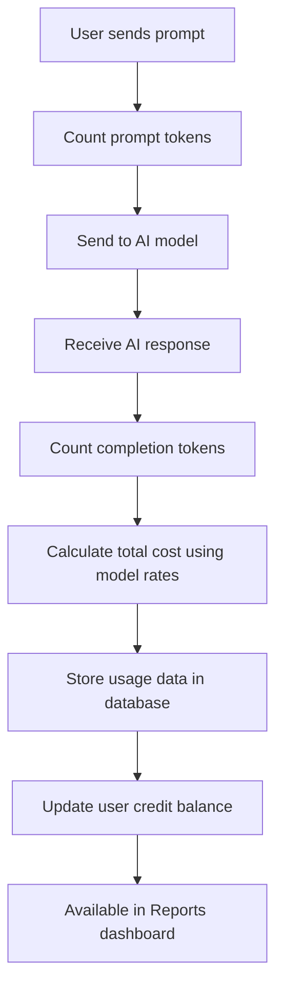

Understand how Weam calculates and tracks credits for your AI model usage across different providers like OpenAI, Anthropic, Gemini, and Hugging Face.

## Overview

Weam's credit system tracks and calculates:
- **Prompt tokens**: Input text sent to the AI model
- **Completion tokens**: AI-generated response text  
- **Total cost**: Credits consumed per request
- **Usage analytics**: Stored per thread/session for reporting and billing

## How Credit Calculation Works

### Token-Based Pricing Model

Credits are calculated based on token usage:
- **Input tokens** (your prompts): Lower cost per token
- **Output tokens** (AI responses): Higher cost per token
- **Model complexity**: Advanced models cost more credits per token

### Real-Time Tracking
- Tokens counted for every AI interaction
- Credits calculated immediately after each response
- Usage stored by user, Brain, and conversation thread
- Available in Reports for monitoring and optimization

## Technical Implementation

### Core Components

#### 1. CostCalculator Class
**Location:** [cost_calc_handler.py](https://github.com/weam-ai/weam/blob/main/ai-python/src/custom_lib/langchain/callbacks/huggingface/cost/cost_calc_handler.py)

Handles token counting and cost calculation for each LLM request.

**Key Methods:**

| Method | Purpose |
|--------|---------|
| `add_prompt_tokens(count: int)` | Tracks input tokens from user prompts |
| `add_completion_tokens(count: int)` | Tracks output tokens from AI responses |
| `calculate_total_cost(model_name: str)` | Calculates total credits using model rates |

#### 2. Async Callback Handler
**Location:** [cost_calc_handler.py](https://github.com/weam-ai/weam/blob/main/ai-python/src/custom_lib/langchain/callbacks/huggingface/cost/cost_calc_handler.py)

Automatically processes and stores cost data after each AI interaction.

**Key Method:**
```python
async def on_llm_end(self, response: LLMResult, **kwargs)
```

**Process Flow:**
1. Collects prompt + completion tokens from the AI response
2. Calls `CostCalculator.calculate_total_cost()` 
3. Creates comprehensive token usage data
4. Stores data via `thread_repo.initialization()`

#### 3. Model Cost Mapping

Each AI provider has specific credit rates defined per 1,000 tokens.

**OpenAI Example:**
```python
MODEL_COST_PER_1K_TOKENS = {
    "gpt-4": 0.06,
    "gpt-4-32k": 0.12, 
    "gpt-3.5-turbo": 0.0015,
    "gpt-4o": 0.005,
    "gpt-4o-mini": 0.00015
}
```

**Gemini Example:**
```python
MODEL_COST_PER_1K_INPUT_TOKENS = {
    "gemini-1.5-flash": 0.000075,
    "gemini-1.5-flash-8b": 0.0000375,
    "gemini-1.5-pro": 0.00125
}

MODEL_COST_PER_1K_OUTPUT_TOKENS = {
    "gemini-1.5-flash": 0.0003,
    "gemini-1.5-flash-8b": 0.00015,
    "gemini-1.5-pro": 0.005
}
```

### Data Persistence

#### ThreadRepository
**Location:** [thread_repository.py](https://github.com/weam-ai/weam/blob/main/ai-python/src/chatflow_langchain/repositories/thread_repository.py)

Stores detailed usage data for each conversation thread:

**Stored Data:**
- Thread/session identification
- Prompt & completion token counts
- Total credit cost per interaction
- Model metadata and timestamps
- User and Brain association

**Usage:**
```python
thread_repo.initialization(
    thread_id=self.thread_id, 
    collection_name=self.collection_name
)
```

## Credit Calculation Workflow



### Step-by-Step Process

1. **User Interaction**: User sends a prompt in any Brain
2. **Token Counting**: System counts input tokens via `add_prompt_tokens()`
3. **AI Processing**: Request sent to selected AI model
4. **Response Analysis**: Completion tokens counted via `add_completion_tokens()`
5. **Cost Calculation**: `calculate_total_cost(model_name)` computes credit usage
6. **Data Storage**: `on_llm_end` callback stores all usage data
7. **Persistence**: `ThreadRepository` handles database storage
8. **Reporting**: Data becomes available in usage analytics

## Multi-Provider Support

### Provider-Specific Handlers

Each AI provider has dedicated cost calculation logic:

**OpenAI Handler:**
- File: [openai/cost/cost_calc_handler.py](https://github.com/weam-ai/weam/blob/main/ai-python/src/custom_lib/langchain/callbacks/openai/cost/cost_calc_handler.py)
- Supports GPT-3.5, GPT-4, GPT-4o models
- Unified pricing for input/output tokens

**Gemini Handler:**
- File: [gemini/cost/cost_calc_handler.py](https://github.com/weam-ai/weam/blob/main/ai-python/src/custom_lib/langchain/callbacks/gemini/cost/cost_calc_handler.py)
- Supports Gemini 1.5 Flash, Pro models
- Separate pricing for input vs output tokens

**Anthropic Handler:**
- File: [anthropic/cost/cost_calc_handler.py](https://github.com/weam-ai/weam/blob/main/ai-python/src/custom_lib/langchain/callbacks/anthropic/cost/cost_calc_handler.py)
- Supports Claude models
- Context-aware pricing for long conversations

**Hugging Face Handler:**
- File: [huggingface/cost/cost_calc_handler.py](https://github.com/weam-ai/weam/blob/main/ai-python/src/custom_lib/langchain/callbacks/huggingface/cost/cost_calc_handler.py)
- Supports open-source models
- Custom pricing configuration

### Implementation Example

```python
# Initialize cost tracking
cost_calculator = CostCalculator()
callback_handler = CostCalcCallbackHandler(thread_id, collection_name)

# Track token usage
cost_calculator.add_prompt_tokens(prompt_tokens)
cost_calculator.add_completion_tokens(completion_tokens)

# Calculate credits
total_credits = cost_calculator.calculate_total_cost(model_name)

# Automatic storage via callback
await callback_handler.on_llm_end(response=llm_response)
```

## Monitoring Your Usage

### Reports Dashboard
Access detailed usage analytics through **Settings** → **Reports**:

**Available Metrics:**
- **Total credits** consumed by user and time period
- **Model usage** breakdown showing which AI models are used most
- **Token efficiency** comparing input vs output token ratios
- **Cost trends** over time for budget planning
- **Team usage** patterns for optimization opportunities

## File Structure Reference

| File/Location | Purpose |
|---------------|---------|
| `cost_calc_handler.py` | Core token counting and cost calculation logic |
| `thread_repository.py` | Database persistence for usage tracking |
| `callbacks/openai/cost_calc_handler.py` | OpenAI-specific cost calculations |
| `callbacks/gemini/cost_calc_handler.py` | Google Gemini cost calculations |
| `callbacks/anthropic/cost_calc_handler.py` | Anthropic Claude cost calculations |
| `callbacks/huggingface/cost_calc_handler.py` | Hugging Face model cost calculations |
| `model_cost_mapping.py` | Credit rates per model and provider |

## Extending to New Providers

To add support for new AI providers:

1. **Create Provider Handler**: Copy existing handler structure
2. **Define Cost Mapping**: Set credit rates per 1K tokens for each model
3. **Implement Callbacks**: Hook into `on_llm_end` for automatic tracking
4. **Use Core Components**: Leverage `CostCalculator` and `ThreadRepository`
5. **Test Integration**: Verify accurate token counting and cost calculation

### Example Template

```python
# New provider handler template
class NewProviderCostHandler(CostCalcCallbackHandler):
    
    MODEL_COST_PER_1K_TOKENS = {
        "new-model-1": 0.002,
        "new-model-2": 0.008,
    }
    
    async def on_llm_end(self, response: LLMResult, **kwargs):
        # Extract tokens from response
        prompt_tokens = response.llm_output.get('prompt_tokens', 0)
        completion_tokens = response.llm_output.get('completion_tokens', 0)
        
        # Calculate cost
        total_cost = self.calculate_cost(prompt_tokens, completion_tokens)
        
        # Store usage data
        await self.store_usage_data(total_cost)
```
---

Understanding credits helps you optimize costs while maximizing the value of AI in your workflows.